# Hercycle Educational Platform - Use Case Diagram

## System Overview
Educational platform for children (ages 10-18) focused on period and sex education with gamified learning.

---

## Mermaid Use Case Diagram

```mermaid
graph TB
    subgraph "Hercycle Educational Platform"
        subgraph "Authentication System"
            UC1[Sign Up with Age Verification]
            UC2[Login]
            UC3[Logout]
            UC4[Verify Authentication Token]
        end

        subgraph "Profile Management"
            UC5[View Profile]
            UC6[Update Profile Information]
            UC7[View Personal Statistics]
        end

        subgraph "Module Learning System"
            UC8[Browse All Modules]
            UC9[Filter Modules by Category]
            UC10[View Module Details]
            UC11[Read Module Content]
            UC12[Start Module]
            UC13[Complete Module]
            UC14[Track Module Progress]
        end

        subgraph "Quiz System"
            UC15[Take Quiz]
            UC16[Submit Quiz Answers]
            UC17[View Quiz Results]
            UC18[View Quiz Explanations]
            UC19[Retry Quiz]
            UC20[View Quiz History]
        end

        subgraph "Dashboard & Progress"
            UC21[View Dashboard]
            UC22[View Overall Progress]
            UC23[View Recent Activity]
            UC24[View Next Recommended Module]
        end

        subgraph "Gamification System"
            UC25[Earn Points]
            UC26[Level Up]
            UC27[View Current Level]
            UC28[Maintain Daily Streak]
            UC29[Earn Badges/Achievements]
            UC30[View Badge Collection]
        end
    end

    Student[Student/Child User<br/>Age 10-18]
    System[System<br/>Automated Process]

    Student -->|performs| UC1
    Student -->|performs| UC2
    Student -->|performs| UC3
    Student -->|performs| UC5
    Student -->|performs| UC6
    Student -->|performs| UC7
    Student -->|performs| UC8
    Student -->|performs| UC9
    Student -->|performs| UC10
    Student -->|performs| UC11
    Student -->|performs| UC12
    Student -->|performs| UC13
    Student -->|performs| UC15
    Student -->|performs| UC16
    Student -->|performs| UC17
    Student -->|performs| UC18
    Student -->|performs| UC19
    Student -->|performs| UC20
    Student -->|performs| UC21
    Student -->|performs| UC22
    Student -->|performs| UC23
    Student -->|performs| UC24
    Student -->|performs| UC27
    Student -->|performs| UC30

    System -->|triggers| UC4
    System -->|triggers| UC14
    System -->|triggers| UC25
    System -->|triggers| UC26
    System -->|triggers| UC28
    System -->|triggers| UC29

    UC1 -.includes.-> UC4
    UC2 -.includes.-> UC4
    UC13 -.includes.-> UC25
    UC16 -.includes.-> UC25
    UC25 -.extends.-> UC26
    UC13 -.includes.-> UC29
    UC16 -.includes.-> UC29
```

---

## Actor Descriptions

### 1. Student/Child User (Primary Actor)
- **Age Range**: 10-18 years
- **Role**: Main user of the educational platform
- **Goals**:
  - Learn about puberty, periods, and sex education
  - Complete modules and quizzes
  - Earn points and level up
  - Track personal progress

### 2. System (Secondary Actor)
- **Role**: Automated system processes
- **Responsibilities**:
  - Validate authentication tokens
  - Track user progress automatically
  - Calculate and award points
  - Determine level progression
  - Check and unlock badges/achievements
  - Update daily streaks

---

## Use Case Descriptions

### Authentication System

#### UC1: Sign Up with Age Verification
- **Actor**: Student
- **Preconditions**: User is not registered
- **Flow**:
  1. User enters username, age, birthday, password
  2. System validates age (must be 10-18)
  3. System validates birthday matches age
  4. System creates account with hashed password
  5. System generates JWT token
- **Postconditions**: User account created, user logged in
- **Validation Rules**:
  - Age must be between 10-18 years
  - Username must be 3-20 characters, unique
  - Email (optional) must be valid format

#### UC2: Login
- **Actor**: Student
- **Preconditions**: User has registered account
- **Flow**:
  1. User enters username and password
  2. System validates credentials
  3. System generates JWT token (7-day expiry)
  4. User redirected to dashboard
- **Postconditions**: User authenticated and logged in

#### UC3: Logout
- **Actor**: Student
- **Preconditions**: User is logged in
- **Flow**:
  1. User clicks logout button
  2. System clears JWT token
  3. User redirected to home page
- **Postconditions**: User logged out

#### UC4: Verify Authentication Token
- **Actor**: System
- **Preconditions**: User attempts to access protected route
- **Flow**:
  1. System checks for JWT token in request
  2. System validates token signature and expiry
  3. System retrieves user data from token
- **Postconditions**: User authorized or denied access

---

### Profile Management

#### UC5: View Profile
- **Actor**: Student
- **Preconditions**: User is logged in
- **Flow**:
  1. User navigates to profile page
  2. System displays user information, statistics, and achievements
- **Display Information**:
  - Username, age, gender
  - Total points and current level
  - Current streak
  - Badges earned
  - Module completion history
  - Quiz scores

#### UC6: Update Profile Information
- **Actor**: Student
- **Preconditions**: User is logged in
- **Flow**:
  1. User edits optional fields (email, gender)
  2. System validates and saves changes
- **Note**: Core fields (username, age, birthday) cannot be changed

#### UC7: View Personal Statistics
- **Actor**: Student
- **Preconditions**: User is logged in
- **Flow**:
  1. User views stats on profile/dashboard
  2. System displays points, level, streak, completion rate
- **Includes**: UC21 (View Dashboard)

---

### Module Learning System

#### UC8: Browse All Modules
- **Actor**: Student
- **Preconditions**: User is logged in
- **Flow**:
  1. User navigates to modules page
  2. System displays all 12 modules in grid layout
  3. Each module shows: icon, title, description, category, status, points
- **Module List** (12 Total):
  1. Welcome to Your Body (Body)
  2. Understanding Puberty (Puberty)
  3. All About Periods (Periods)
  4. Period Products 101 (Periods)
  5. Managing Period Symptoms (Periods)
  6. Hygiene and Self-Care (Hygiene)
  7. Emotional Changes and Mental Health (Emotions)
  8. Your Changing Body (Body)
  9. Healthy Relationships (Relationships)
  10. Body Safety and Consent (Safety)
  11. Nutrition and Exercise (General)
  12. Your Questions Answered (General)

#### UC9: Filter Modules by Category
- **Actor**: Student
- **Preconditions**: User is on modules page
- **Flow**:
  1. User selects category filter
  2. System filters and displays matching modules
- **Categories**: All, Body, Puberty, Periods, Hygiene, Emotions, Relationships, Safety, General
- **Extends**: UC8

#### UC10: View Module Details
- **Actor**: Student
- **Preconditions**: User is logged in
- **Flow**:
  1. User clicks on module card
  2. System displays full module content
  3. Shows: title, description, estimated time, points value, status

#### UC11: Read Module Content
- **Actor**: Student
- **Preconditions**: User has opened module
- **Flow**:
  1. System displays content sections in order
  2. User scrolls through text, tips, and key takeaways
- **Content Types**: Text sections, Tips (highlighted), Key Takeaways (bulleted list)
- **Includes**: UC10

#### UC12: Start Module
- **Actor**: Student (initiated), System (executes)
- **Preconditions**: Module status is "Not Started"
- **Flow**:
  1. User opens module for first time
  2. System updates status to "In Progress"
  3. System records startedAt timestamp
- **Postconditions**: Module marked as in-progress

#### UC13: Complete Module
- **Actor**: Student
- **Preconditions**: User has read module content
- **Flow**:
  1. User clicks "Mark as Complete"
  2. System updates status to "Completed"
  3. System awards 50 points (if first completion)
  4. System calculates new level
  5. System checks for badge unlocks
  6. System shows celebration modal
- **Postconditions**: Module completed, points awarded, progress updated
- **Includes**: UC25 (Earn Points), UC29 (Earn Badges)

#### UC14: Track Module Progress
- **Actor**: System
- **Preconditions**: User interacts with modules
- **Flow**:
  1. System records progress status changes
  2. System updates lastAccessedAt timestamp
  3. System calculates time spent
- **Status Values**: Not Started, In Progress, Completed

---

### Quiz System (Planned - Phase 3)

#### UC15: Take Quiz
- **Actor**: Student
- **Preconditions**: User has completed associated module
- **Flow**:
  1. User starts quiz for completed module
  2. System displays questions one at a time (8-10 questions)
  3. User selects answers (multiple choice A/B/C/D)
- **Quiz Structure**: 8-10 questions per module, 10 points per question

#### UC16: Submit Quiz Answers
- **Actor**: Student
- **Preconditions**: User has answered all questions
- **Flow**:
  1. User submits completed quiz
  2. System grades answers
  3. System calculates score and percentage
  4. System determines pass/fail (60% passing score)
  5. System awards points for correct answers
  6. System checks for bonus points (perfect score, first attempt)
- **Postconditions**: Quiz attempt recorded, points awarded
- **Points**: 10 per correct answer, +20 for perfect score, +10 for first attempt
- **Includes**: UC25 (Earn Points)

#### UC17: View Quiz Results
- **Actor**: Student
- **Preconditions**: User has submitted quiz
- **Flow**:
  1. System displays results page
  2. Shows: score, percentage, pass/fail status, points earned
  3. Highlights correct/incorrect answers
- **Includes**: UC18

#### UC18: View Quiz Explanations
- **Actor**: Student
- **Preconditions**: User is viewing quiz results
- **Flow**:
  1. System displays explanation for each question
  2. Shows correct answer and why it's correct
- **Included In**: UC17

#### UC19: Retry Quiz
- **Actor**: Student
- **Preconditions**: User wants to improve score
- **Flow**:
  1. User starts new quiz attempt
  2. System increments attempt number
  3. System allows retake with same questions
- **Note**: Points only awarded once per question

#### UC20: View Quiz History
- **Actor**: Student
- **Preconditions**: User has taken quizzes
- **Flow**:
  1. User navigates to quiz history
  2. System displays all quiz attempts with scores and dates

---

### Dashboard & Progress

#### UC21: View Dashboard
- **Actor**: Student
- **Preconditions**: User is logged in
- **Flow**:
  1. User logs in or navigates to dashboard
  2. System displays comprehensive overview
- **Dashboard Components**:
  - Welcome message with username
  - Stats cards (Total Points, Current Level, Streak)
  - Overall progress bar with percentage
  - Module statistics (Total, Completed, In Progress)
  - Recent modules (first 3)
  - Completion status badges
- **Includes**: UC7, UC22, UC23

#### UC22: View Overall Progress
- **Actor**: Student
- **Preconditions**: User is logged in
- **Flow**:
  1. System calculates completion percentage
  2. System displays progress bar
  3. Shows completed vs total modules
- **Calculation**: (Completed Modules / Total Modules) × 100%
- **Included In**: UC21

#### UC23: View Recent Activity
- **Actor**: Student
- **Preconditions**: User has started modules
- **Flow**:
  1. System displays last 3 accessed modules
  2. Shows module status and quick access links
- **Included In**: UC21

#### UC24: View Next Recommended Module
- **Actor**: Student
- **Preconditions**: User has not completed all modules
- **Flow**:
  1. System suggests next module to complete
  2. Prioritizes in-progress modules, then not-started
- **Included In**: UC21

---

### Gamification System

#### UC25: Earn Points
- **Actor**: System
- **Trigger**: User completes module or quiz
- **Flow**:
  1. System calculates points earned
  2. System adds points to totalPoints
  3. System checks if level threshold reached
- **Point Sources**:
  - Module completion: 50 points (first time only)
  - Quiz correct answer: 10 points each
  - Perfect quiz: +20 bonus
  - First quiz attempt: +10 bonus
  - Badge unlock: 10-100 points (varies by rarity)
- **Triggered By**: UC13, UC16

#### UC26: Level Up
- **Actor**: System
- **Trigger**: User earns enough points for next level
- **Preconditions**: totalPoints ≥ next level threshold
- **Flow**:
  1. System calculates new level based on points
  2. System updates currentLevel
  3. System displays level-up celebration
  4. System checks for level-based badge unlocks
- **Level Thresholds**:
  - Level 1: 0-199 points (Beginner)
  - Level 2: 200-499 points (Explorer)
  - Level 3: 500-999 points (Learner)
  - Level 4: 1000-1999 points (Scholar)
  - Level 5: 2000-3499 points (Expert)
  - Level 6: 3500-5499 points (Master)
  - Level 7: 5500+ points (Champion)
- **Extends**: UC25

#### UC27: View Current Level
- **Actor**: Student
- **Preconditions**: User is logged in
- **Flow**:
  1. User views level badge on dashboard/profile
  2. System displays current level and title
  3. Shows points needed for next level
- **Included In**: UC21, UC5

#### UC28: Maintain Daily Streak
- **Actor**: System
- **Trigger**: User logs in each day
- **Flow**:
  1. System checks lastActiveDate
  2. If consecutive day, increment currentStreak
  3. If gap > 1 day, reset streak to 1
  4. Update lastActiveDate to today
- **Streak Milestones**:
  - 3 days: "Getting Started" badge
  - 7 days: "On Fire" badge
  - 14 days: "Unstoppable" badge
  - 30 days: "Legend" badge

#### UC29: Earn Badges/Achievements
- **Actor**: System
- **Trigger**: User meets badge criteria
- **Preconditions**: Badge not already earned
- **Flow**:
  1. System checks achievement criteria after actions
  2. If criteria met, unlock badge
  3. Add badge to user's collection
  4. Award points reward
  5. Display celebration animation
- **Badge Categories**:
  - **Milestone**: First Steps (1 module), Quarter Way (3), Halfway Hero (6), Almost There (9), Knowledge Champion (12)
  - **Perfect Score**: Perfect Start (1st perfect), Quiz Master (5 perfect), Genius Mind (10 perfect)
  - **Streak**: Getting Started (3 days), On Fire (7), Unstoppable (14), Legend (30)
  - **Points**: Rising Star (500), Shining Bright (1000), Super Star (2500), Ultimate Star (5000)
  - **Special**: Early Bird (login before 9am), Night Owl (login after 9pm), Weekend Warrior, Speed Learner
- **Triggered By**: UC13, UC16, UC28

#### UC30: View Badge Collection
- **Actor**: Student
- **Preconditions**: User is logged in
- **Flow**:
  1. User navigates to achievements page
  2. System displays all available badges
  3. Shows earned badges (color) and locked badges (grayscale)
  4. Displays badge details: name, description, rarity, date earned
- **Badge Rarity Levels**: Common, Rare, Epic, Legendary

---

## Use Case Relationships

### Include Relationships
- **UC1 (Sign Up)** includes **UC4 (Verify Token)** - Token generated and verified
- **UC2 (Login)** includes **UC4 (Verify Token)** - Token created on login
- **UC11 (Read Content)** includes **UC10 (View Details)** - Must view to read
- **UC13 (Complete Module)** includes **UC25 (Earn Points)** - Always awards points
- **UC13 (Complete Module)** includes **UC29 (Earn Badges)** - May trigger badges
- **UC16 (Submit Quiz)** includes **UC25 (Earn Points)** - Awards points for correct answers
- **UC16 (Submit Quiz)** includes **UC29 (Earn Badges)** - May unlock achievements
- **UC17 (View Results)** includes **UC18 (View Explanations)** - Results show explanations
- **UC21 (View Dashboard)** includes **UC7, UC22, UC23** - Dashboard aggregates multiple views

### Extend Relationships
- **UC9 (Filter Modules)** extends **UC8 (Browse Modules)** - Optional filtering
- **UC25 (Earn Points)** extends **UC26 (Level Up)** - Points may trigger level up

### Generalization Relationships
- **UC5, UC6, UC7** are specializations of Profile Management
- **UC15-UC20** are specializations of Quiz System
- **UC25-UC30** are specializations of Gamification System

---

## System Boundaries

### In Scope (Current Implementation)
✅ Authentication (Sign Up, Login, Logout)
✅ Profile Management (View, Update)
✅ Module System (Browse, Filter, View, Complete)
✅ Dashboard (Progress, Stats, Activity)
✅ Basic Gamification (Points, Levels, Progress Tracking)

### Planned for Future Phases
⏳ Quiz System (Phase 3)
⏳ Badge/Achievement System (Phase 4)
⏳ Streak Tracking (Phase 4)
⏳ Advanced Animations (Phase 5)
⏳ Module Content Enhancement (Phase 6)

---

## Security Constraints

1. **Age Verification**: System enforces 10-18 age range at signup
2. **Authentication**: JWT tokens required for all protected routes
3. **Password Security**: Bcrypt hashing with 10 salt rounds
4. **Data Privacy**: Email and gender are optional fields
5. **Input Validation**: All user inputs validated on backend

---

## Non-Functional Requirements

### Performance
- Module list loads in <2 seconds
- Quiz submissions processed in <1 second
- Dashboard renders in <1.5 seconds

### Usability
- Child-friendly UI with cartoon/illustrated style
- Clear progress indicators
- Immediate feedback on actions
- Celebration animations for achievements

### Accessibility
- Minimum 16px font size
- High contrast colors
- Clear, readable fonts (Quicksand, Nunito)
- Simple navigation

### Reliability
- 99% uptime
- Automatic progress saving
- Data persistence in MongoDB

---

## Future Enhancements

1. **Social Features**: Friend system, leaderboards
2. **Parent Dashboard**: Parent monitoring and reports
3. **Content Expansion**: Videos, interactive animations
4. **Multilingual Support**: Multiple language options
5. **Mobile App**: Native iOS/Android apps
6. **AI Chatbot**: Q&A assistant for questions
7. **Certificate System**: Printable completion certificates
